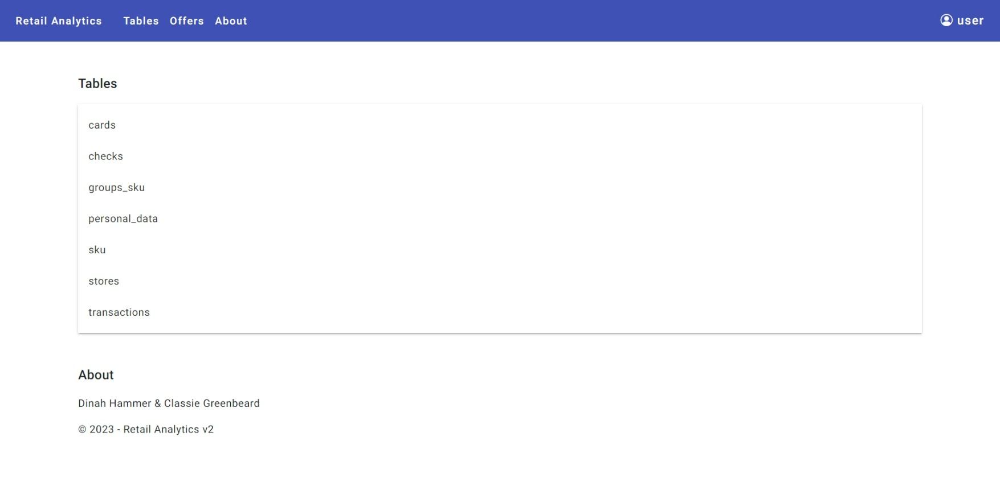

# RetailAnalitycs

В данном проекте реализован web-интерфейс для ранее созданной базы данных. 
Приложение поддерживает CRUD-операции, импорт/экспорт таблиц, авторизацию, запуск операций/функций базы через графический интерфейс, а также логирование действий пользователя. 
Web-приложение реализовано с использованием **ASP.NET MVC Framework**. 
В качестве ORM фреймворка выбран **Entity Framework Core** 
SPA-frontend реализован на **Angular**.

### Авторизация
Существуют два заранее созданных аккаунта
- Username - admin, Password - admin
- Username - user,  Password - user

### Retail Analytics
Вкладка *Retail Analytics* включается в себя все доступные вкладки

user:

admin:

### Tables
Вкладка *Tables* показывает все доступные таблицы базы данных. 
User способен только просматривать таблицы. 
Admin способен редактировать таблицы, импортировать и экспортировать.

Таблица sku(user):

Таблица sku(admin):

Таблица sku, редактирование(admin):

### Offers
Вкладка *Offers* показывает 3 функции базы данных и позволяет их выполнять и экспортировать. 
Доступна только *admin*.

Функция Cross-selling

### About
Вкладка *About* показывает информацию о разработчиках

### Логирование
В контейнере api в папке app/logs каждый день создаётся новый файл с логами.

